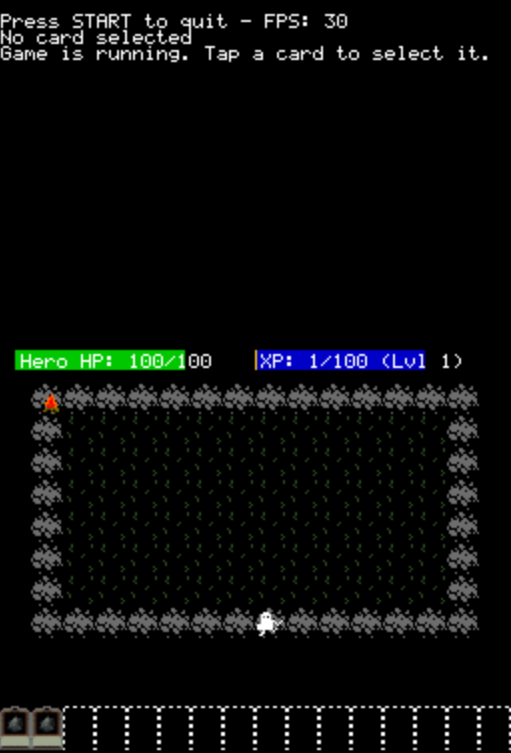

# Loop Hero DS

A DS demake of Loop Hero, a game by Four Quarters.

As of now, the main focus is on building the core system of the game, which is the tile system and the combat system.
Once this is done, adding new tiles and enemies should be easy.

## Featuremap
- [x] Player can place tiles on the map
- [x] Player levels up and improves stats
- [x] Enemy spawn on tiles and start fighting the player
- [ ] Player can equip items -> items will probably be auto-equipped
- [ ] Player can collect resources from defeated enemies
- [ ] Random path generation
- [ ] Encyclopedia
- [ ] Main Menu
- [ ] Camp to place stuff (low priority)

## Install 

1. Get MicroLUA from https://www.gamebrew.org/wiki/Micro_Lua_DS (carefully follow the instructions, otherwise it won't work)
2. Put the source code folder into lua/scripts/
3. To play in DeSmuME, navigate to Config > Slot 2 (GBA Slot)
4. From there change the drop down to Flash Card Device and the folder to the folder with MicroLua 4.7.2.nds

